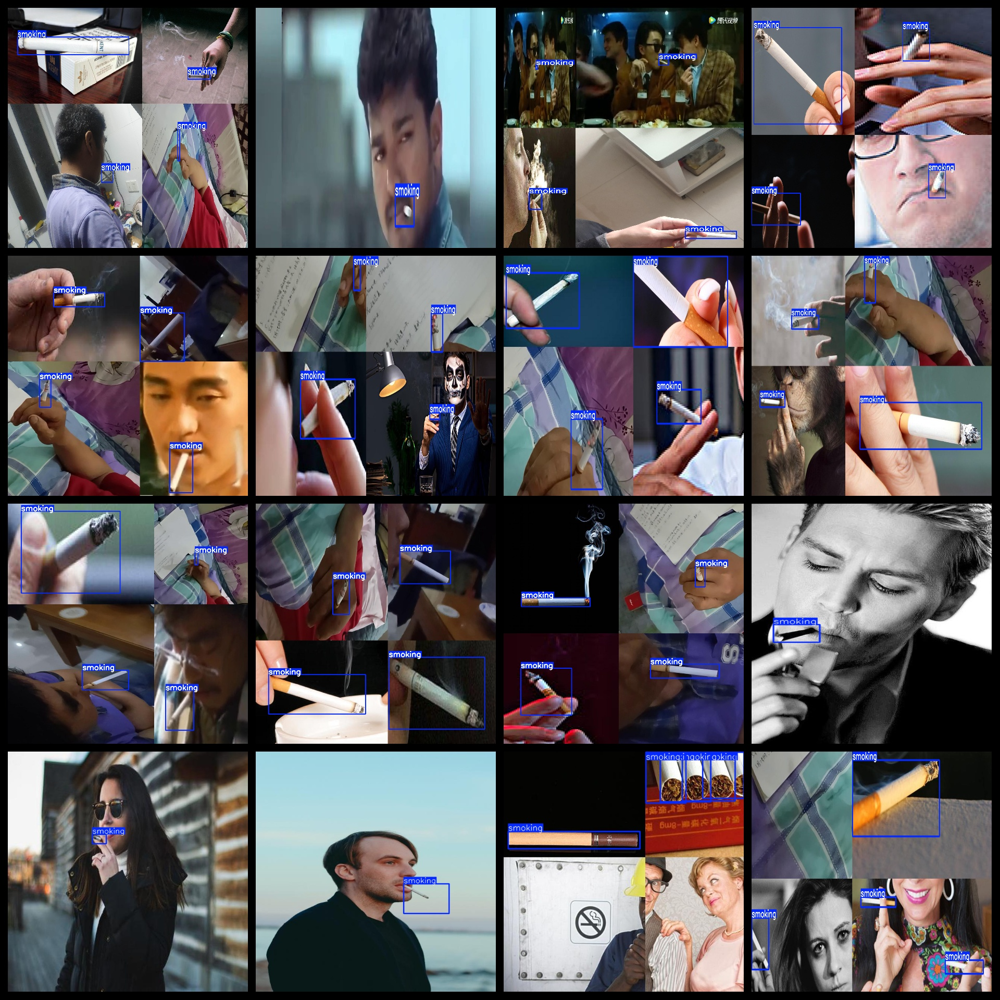
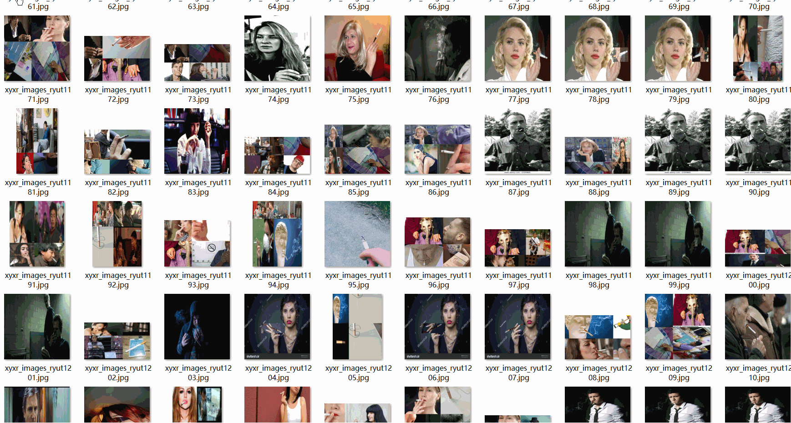

# Smoking Detection Dataset 7071 imagesVOC+YOLO format

The smoking detection dataset contains 7071 VOC+YOLO format images.

Dataset format: Pascal VOC format + YOLO format (the txt file does not contain the split path, it only contains jpg images and corresponding VOC format xml files and yolo format txt files)

Number of images (jpg file count): 7071

Number of XML files: 7071

Number of annotations (number of txt files): 7071

Number of categories: 1

The Github repository is: datasets_sl

Category Name: ["smoking"]

Number of boxes labeled in each category:

Smoking frames = 18090

Total Frames: 18090

Number of images per category:

Smoking occupies a total of 7071 pictures.

Image resolution: Multi-resolution images, such as 1280x720, 640x640, etc.

Use the labeling tool: labelImg

Dataset Augmentation: Yes

Rules for annotation: Draw a rectangle around the category.

Important Note: The dataset does not have a split into training, validation, and test sets; you will need to create your own. The dataset includes images of cigarettes in the mouth and hands, with a few instances of individual cigarettes.

Special Disclaimer: This dataset does not guarantee the accuracy of the trained models or weight files.

Annotation and image details are as follows:

## Images

---

Here is a pay link on Stripe (https://buy.stripe.com/3cs8yP7sY87d0vu9AB). Please contact me lonlonago@foxmail.com after funding $89, and I will send you a complete data files, thank you!

